# inVtero.net Architecture

## Overview

inVtero.net is a cross-platform memory forensics framework designed for Virtual Machine Introspection (VMI) and physical memory analysis. The project uses microarchitecture-independent techniques to locate and extract process information from memory dumps without relying on OS-specific structures.

## Design Philosophy

The core design principle is to **avoid OS-logical dependencies** and instead leverage low-level hardware and CPU interaction patterns that are consistent across different operating systems and versions. This approach provides:

- **Future-proofing**: Works with unknown OS versions and future updates
- **Security**: Harder for attackers to manipulate underlying detection mechanisms
- **Versatility**: Single codebase handles multiple OS types (Windows, Linux, BSD)
- **Accuracy**: Based on hardware-level invariants rather than mutable OS structures

## Key Components

### 1. Core Engine (`inVtero.net`)

The main library implementing the analysis engine.

#### Core Classes

- **`Vtero`** (`inVtero.cs`): Main orchestration class that coordinates the entire analysis process
- **`Mem`** (`Mem.cs`): Physical memory abstraction and access layer
- **`PageTable`** (`PageTable.cs`): Page table parsing and virtual-to-physical address translation
- **`DetectedProc`** (`DetectedProc.cs`): Represents a detected process with its address space
- **`Scanner`** (`Scanner.cs`): Scans physical memory for process signatures
- **`VirtualScanner`** (`VirtualScanner.cs`): Scans virtual address spaces
- **`PhysicalMemoryStream`**: Provides stream-based access to physical memory

### 2. Memory Detection Techniques

#### Self-Pointer/Recursive Page Directory Detection

The primary technique for identifying processes without OS knowledge:

```
Windows: Self-pointer in PML4 (Page Map Level 4)
*BSD:    Recursive page directory pointer
Linux:   Direct mapping regions
```

This technique works by:
1. Scanning physical memory for page table structures
2. Identifying the self-referential entry pattern
3. Extracting CR3 values (page table base pointers)
4. Validating page table hierarchies

#### VMCS (Virtual Machine Control Structure) Detection

For nested hypervisor analysis:

1. Locates VMCS pages by signature
2. Extracts EPTP (Extended Page Table Pointer) from VMCS
3. Maps guest physical to host physical memory
4. Recursively processes nested virtualization layers

### 3. Specialties Module

Format-specific memory dump handlers in `inVtero.net/Specialties/`:

- **`VMWare.cs`**: VMware memory dump format (.vmem, .vmsn)
- **`XEN.cs`**: Xen hypervisor dump format
- **`CrashDump.cs`**: Windows crash dump (PAGEDUMP64) format
- **`AMemoryRunDetector.cs`**: Base class for memory run detection
- **`BasicRunDetector.cs`**: Generic memory run detection

### 4. Type System and Symbol Resolution

#### DIA Integration (`Dia2Sharp`)

Uses Microsoft Debug Interface Access SDK for symbol resolution:

- PDB file parsing
- Type information extraction
- Structure layout resolution
- Symbol-to-address mapping

#### Dynamic Type System

Leverages .NET Dynamic Language Runtime (DLR) for:
- Python scripting interface (IronPython)
- Dynamic member access on memory structures
- Runtime type reflection and binding

### 5. Support Modules

Located in `inVtero.net/Support/`:

- **`Capstone.cs`**: Disassembly engine integration
- **`Keystone.cs`**: Assembly engine integration
- **`JunctionPoint.cs`**: File system junction management
- **`Strings.cs`**: String extraction utilities
- **`WebAPI.cs`**: HTTP API support

### 6. Hashing and Integrity

Located in `inVtero.net/Hashing/`:

- **Hash-based code page verification**
- **Cryptographic attestation** (SHA256, TIGER192)
- **DeLocate** (`DeLocate.cs`): Matches memory pages to disk hashes
- **Relocation normalization** for hash comparison

### 7. PowerShell Integration (`inVteroPS`)

PowerShell cmdlets for memory analysis:
- Process enumeration
- Memory dumping
- Type resolution
- Scripting automation

### 8. UI Components

#### Console Utilities (`ConsoleUtils`)
- Progress bars
- Colored output
- Tabular data display

#### GUI (`inVteroUI`)
- Memory editing interface
- Disassembly viewer
- Hex editor with patching
- Interactive memory navigation

## Data Flow

### Analysis Pipeline

```mermaid
flowchart TD
    Start([🚀 Start Analysis]) --> Input[📁 Memory Dump File]
    
    Input --> Format{🔍 Detect Format}
    Format -->|VMware| VM[🖥️ VMware Parser]
    Format -->|Xen| XEN[🌐 Xen Parser]
    Format -->|Crash| CRASH[💥 Crash Dump Parser]
    Format -->|Raw| RAW[📄 Raw Parser]
    
    VM --> Mem[💾 Mem Class<br/>Memory Access Layer]
    XEN --> Mem
    CRASH --> Mem
    RAW --> Mem
    
    Mem --> Scanner[🔎 Scanner<br/>Physical Memory Scan]
    Scanner --> SP[🎯 Self-Pointer<br/>Detection]
    Scanner --> VMCS[🌀 VMCS<br/>Detection]
    
    SP --> PT[📑 Page Table<br/>Construction]
    VMCS --> PT
    
    PT --> Proc[👤 DetectedProc<br/>Process Objects]
    
    Proc --> Group{🔄 Process<br/>Grouping}
    Group -->|Same VM| G1[👥 Group 1<br/>Windows]
    Group -->|Different VM| G2[👥 Group 2<br/>Linux]
    Group -->|Nested| G3[👥 Group 3<br/>Nested VM]
    
    G1 --> Sym[🔐 Symbol Loading]
    G2 --> Sym
    G3 --> Sym
    
    Sym --> Type[📊 Type Extraction]
    Type --> Analysis[✨ Analysis Scripts]
    Analysis --> Output([📈 Results])
    
    style Start fill:#4caf50,stroke:#2e7d32,stroke-width:3px,color:#fff
    style Output fill:#4caf50,stroke:#2e7d32,stroke-width:3px,color:#fff
    style Format fill:#ff9800,stroke:#e65100,stroke-width:2px,color:#fff
    style Scanner fill:#2196f3,stroke:#0d47a1,stroke-width:2px,color:#fff
    style PT fill:#9c27b0,stroke:#4a148c,stroke-width:2px,color:#fff
    style Sym fill:#f44336,stroke:#b71c1c,stroke-width:2px,color:#fff
    style Analysis fill:#00bcd4,stroke:#006064,stroke-width:2px,color:#fff
```



## Memory Run Management

### Problem
Memory dumps may use sparse storage (only storing non-zero pages), creating gaps in physical address space.

### Solution
- **Memory Run Detection**: Identifies contiguous physical memory regions
- **Gap Handling**: Tracks which physical addresses are actually present
- **PFN Bitmap**: Maintains bitmap of valid Page Frame Numbers
- **Run Metadata**: Stores base address and page count for each run

## Process Detection Algorithm

### Detection Phases


## Hypervisor Support

### Nested Virtualization Architecture

```mermaid
graph TB
    subgraph "🖥️ Physical Host"
        PM[Physical Memory]
        HVMCS[Host VMCS Pages]
        HCR3[Host CR3 Values]
    end
    
    subgraph "🌐 Hypervisor Layer 1"
        HV1[VMware/Xen/Hyper-V]
        EPTP1[EPTP Index 14]
        GVM1[Guest VM Control]
    end
    
    subgraph "💻 Guest VM 1"
        GCR3_1[Guest CR3]
        GPT1[Guest Page Tables]
        GPROC1[Guest Processes]
    end
    
    subgraph "💻 Guest VM 2 - Nested"
        NVMCS[Nested VMCS]
        NEPTP[Nested EPTP]
        NVM[Nested Guest VM]
    end
    
    PM -->|Scan| HVMCS
    HVMCS -->|Extract| EPTP1
    EPTP1 -->|Map| GVM1
    
    GVM1 -->|VM1| GCR3_1
    GVM1 -->|VM2 Nested| NVMCS
    
    GCR3_1 --> GPT1
    GPT1 --> GPROC1
    
    NVMCS --> NEPTP
    NEPTP --> NVM
    
    HCR3 -.->|Self-Pointer<br/>Detection| GPT1
    
    style PM fill:#263238,stroke:#000,stroke-width:3px,color:#fff
    style HVMCS fill:#37474f,stroke:#000,stroke-width:2px,color:#fff
    style HV1 fill:#0277bd,stroke:#01579b,stroke-width:2px,color:#fff
    style GCR3_1 fill:#00897b,stroke:#00695c,stroke-width:2px,color:#fff
    style GPROC1 fill:#43a047,stroke:#2e7d32,stroke-width:2px,color:#fff
    style NVMCS fill:#5e35b1,stroke:#4527a0,stroke-width:2px,color:#fff
    style NVM fill:#8e24aa,stroke:#6a1b9a,stroke-width:2px,color:#fff
```



### VMware Detection Flow


## Performance Optimizations

### Parallel Processing
- Multi-threaded memory scanning
- Concurrent page table walking
- Parallel process validation

### Caching
- Page cache for frequently accessed memory
- Memory-mapped file access
- Bitmap indexing for PFN lookups

### Memory Efficiency
- Stream-based memory access
- Lazy loading of page tables
- Sparse data structures for large address spaces

## Serialization and State Management

### Protocol Buffers
- Saves analysis state to `.inVtero` files
- Fast deserialization for repeated analysis
- Checkpoint/resume capability

### State Components
- Detected processes
- Page table structures
- Symbol information
- Memory run metadata

## Cross-Platform Support

### .NET Framework (Windows)
- Full feature set
- DIA symbol support
- PowerShell integration

### .NET Core (Linux, macOS, BSD)
- Symbol servers for type resolution
- Subset of Windows features
- Core analysis functionality

## Extension Points

### Custom Memory Run Detectors
Implement `IMemAwareChecking` interface:
```csharp
public interface IMemAwareChecking
{
    bool IsSupportedFormat(Mem mem);
    MemoryDescriptor ExtractMemory(Mem mem);
}
```

### Custom Scanners
Extend `AMemoryRunDetector` base class for new dump formats.

### Python Scripting
Use IronPython to extend functionality:
- Custom memory walkers
- Structure parsers
- Analysis workflows

## Security Considerations

### Trustworthy Analysis
- Hardware-based detection resists OS-level tampering
- Cryptographic hash verification of code pages
- No dependency on potentially compromised OS structures

### Hash-Based Attestation
- Compare memory pages to known-good hashes
- Detect code modifications
- Identify injected/hooked code

### Limitations
- Assumes hardware page tables are trustworthy
- SMM (System Management Mode) not analyzed
- Firmware-level rootkits not detected

## Project Structure

```
inVtero.net/
├── inVtero.net/          # Core library
│   ├── Specialties/      # Format handlers
│   ├── Support/          # Utility classes
│   ├── Hashing/          # Integrity verification
│   ├── PS/               # PowerShell support
│   └── GUI/              # UI components
├── inVtero.core/         # .NET Core version
│   ├── inVteroCore/      # Core functionality
│   ├── Dia2Sharp/        # Symbol resolution
│   └── quickcore/        # Core quickdumps
├── quickdumps/           # Example application
├── inVteroUI/            # GUI application
├── inVteroPS/            # PowerShell module
├── ConsoleUtils/         # Console helpers
├── Dia2Sharp/            # DIA interop
├── Scripts/              # Python analysis scripts
└── Reloc.net/            # Relocation utilities
```

## Dependencies

### Required
- .NET Framework 4.6.1+ (Windows) or .NET Core 2.0+ (Cross-platform)
- msdia140.dll (Windows, for symbol resolution)

### Optional
- Capstone (disassembly)
- Keystone (assembly)
- IronPython (scripting)
- libyara (pattern matching)

## Future Directions

### Planned Enhancements
- 5-level page table support (Intel's LA57)
- ARM64 architecture support
- Enhanced nested virtualization detection
- Improved memory gap handling
- Automated EPTP index brute-forcing

### Research Areas
- SMM analysis integration
- Firmware introspection
- Real-time memory monitoring
- Automated malware detection workflows

## References

- [Actaeon Project](http://www.syssec-project.eu/m/page-media/3/raid13_graziano.pdf) - VMCS-based VM extraction
- [Rekall](https://github.com/google/rekall) - Memory forensics framework
- [Volatility](https://www.volatilityfoundation.org/) - Memory analysis framework
- Intel VT-x Specification - Virtualization extensions
- AMD-V Specification - AMD virtualization
