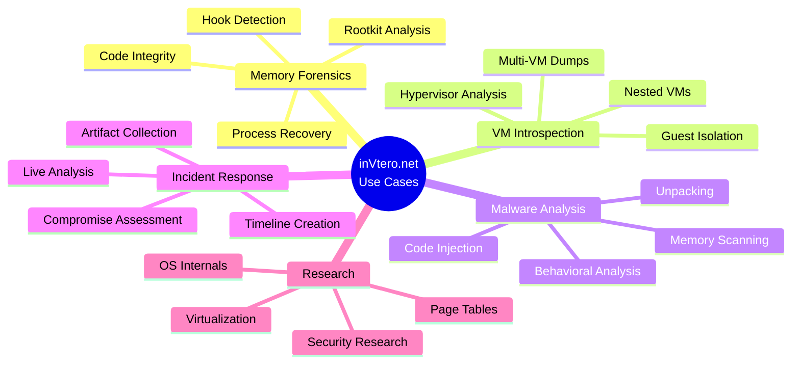
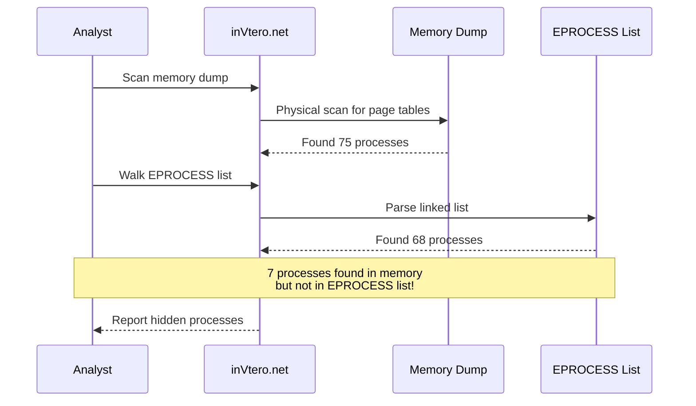
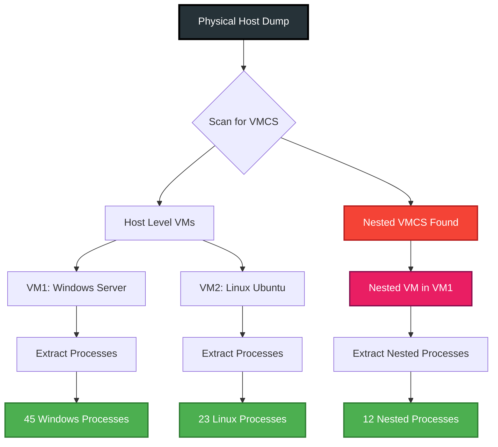
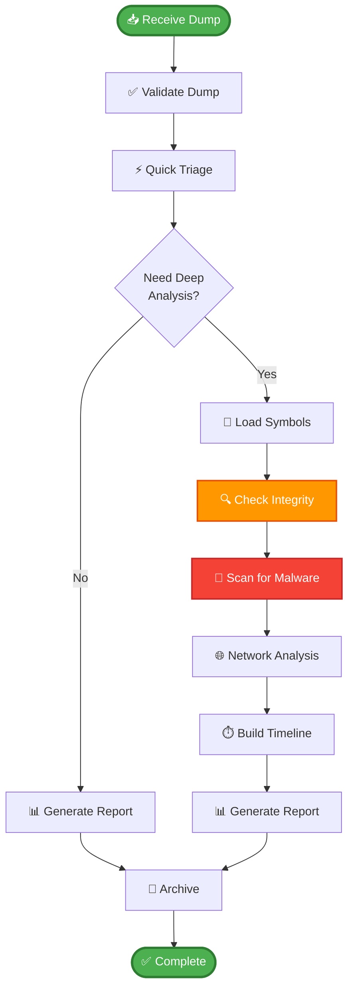

# Examples and Use Cases

## Table of Contents
- [Quick Examples](#quick-examples)
- [Memory Forensics Scenarios](#memory-forensics-scenarios)
- [VM Introspection](#vm-introspection)
- [Malware Analysis](#malware-analysis)
- [Incident Response](#incident-response)
- [Research and Education](#research-and-education)

## 🎯 Use Case Overview



## Quick Examples

### Example 1: Basic Process Listing

**Scenario**: Quick triage of a memory dump to list all running processes.

**Command Line**:
```cmd
quickdumps.exe -f suspect.dmp > process_list.txt
```

**Python**:
```python
import clr
clr.AddReferenceToFileAndPath("inVtero.net.dll")
from inVtero.net import *

opts = ConfigOptions()
opts.FileName = "suspect.dmp"
vtero = Scan.Scanit(opts)

print("=" * 60)
print("PROCESS LISTING")
print("=" * 60)
print(f"{'CR3':<18} {'Type':<12} {'File Offset':<18}")
print("-" * 60)

for proc in vtero.Processes:
    print(f"{proc.CR3Value:016X}   {str(proc.PageTableType):<12} {proc.FileOffset:016X}")
```

**Expected Output**:
```
============================================================
PROCESS LISTING
============================================================
CR3                Type         File Offset       
------------------------------------------------------------
00000000001AB000   Windows      00000001308D3000
00000000016A0000   Windows      00000001262DA000
000000001FCA000    Windows      0000000145E23000
```

### Example 2: Symbol Resolution and Module Listing

**Scenario**: Examine loaded kernel modules and verify integrity.

```python
# Load dump and get kernel process
opts = ConfigOptions()
opts.FileName = "memory.dmp"
vtero = Scan.Scanit(opts)

kernel = min(vtero.Processes, key=lambda p: p.CR3Value)
kernel.MemAccess = Mem(vtero.MemAccess)

# Load symbols
print("[*] Loading kernel symbols...")
kvs = kernel.ScanAndLoadModules()

# List modules with integrity check
print("\n" + "=" * 80)
print("KERNEL MODULES")
print("=" * 80)
print(f"{'Module Name':<30} {'Base Address':<18} {'Size':<12} {'Status'}")
print("-" * 80)

for module in kvs.Modules:
    status = "[OK]" if module.VerifyHash() else "[MODIFIED]"
    print(f"{module.Name:<30} {module.BaseAddress:016X}   {module.Size:<12} {status}")
```

### Example 3: Extract Specific Process Memory

**Scenario**: Dump a specific process by CR3 value for offline analysis.

```python
# Find target process
target_cr3 = 0x1AB000
target_proc = next((p for p in vtero.Processes if p.CR3Value == target_cr3), None)

if target_proc:
    print(f"[+] Found process with CR3: {target_cr3:016X}")
    print(f"[*] Extracting memory...")
    
    # Dump to file
    output_file = f"process_{target_cr3:X}_dump.bin"
    target_proc.DumpASToFile(output_file)
    
    print(f"[+] Process memory saved to: {output_file}")
else:
    print(f"[-] Process with CR3 {target_cr3:016X} not found")
```

## Memory Forensics Scenarios

### Scenario 1: Detect Hidden Processes



**Implementation**:
```python
def find_hidden_processes(vtero, kernel_proc):
    """Compare hardware-detected processes vs OS list"""
    
    # Get all processes from page table scan
    hardware_processes = set(p.CR3Value for p in vtero.Processes)
    
    # Walk EPROCESS list
    kvs = kernel_proc.ScanAndLoadModules()
    eprocess_list = walk_process_list(vtero, kernel_proc)
    os_processes = set(p['cr3'] for p in eprocess_list)
    
    # Find hidden processes
    hidden = hardware_processes - os_processes
    
    print(f"\n[*] Hardware detected: {len(hardware_processes)} processes")
    print(f"[*] OS EPROCESS list: {len(os_processes)} processes")
    print(f"[!] Hidden processes: {len(hidden)}")
    
    if hidden:
        print("\n🚨 HIDDEN PROCESSES DETECTED:")
        for cr3 in hidden:
            print(f"  CR3: {cr3:016X}")
    
    return hidden

# Usage
hidden = find_hidden_processes(vtero, kernel)
```

### Scenario 2: Verify Kernel Integrity

**Goal**: Check if kernel and critical drivers have been modified.

```python
def verify_kernel_integrity(kvs):
    """Verify kernel module integrity"""
    
    critical_modules = [
        'ntoskrnl.exe',
        'hal.dll',
        'tcpip.sys',
        'ndis.sys',
        'fltmgr.sys'
    ]
    
    results = {
        'verified': [],
        'modified': [],
        'not_found': []
    }
    
    print("\n" + "=" * 70)
    print("🔐 KERNEL INTEGRITY VERIFICATION")
    print("=" * 70)
    
    for mod_name in critical_modules:
        module = next((m for m in kvs.Modules if mod_name.lower() in m.Name.lower()), None)
        
        if not module:
            results['not_found'].append(mod_name)
            print(f"❌ {mod_name:<20} NOT FOUND")
            continue
        
        if module.VerifyHash():
            results['verified'].append(mod_name)
            print(f"✅ {mod_name:<20} VERIFIED")
        else:
            results['modified'].append(mod_name)
            print(f"🚨 {mod_name:<20} MODIFIED!")
    
    # Summary
    print("\n" + "=" * 70)
    print(f"Verified: {len(results['verified'])}")
    print(f"Modified: {len(results['modified'])}")
    print(f"Not Found: {len(results['not_found'])}")
    
    if results['modified']:
        print("\n⚠️  WARNING: System integrity compromised!")
    
    return results

# Usage
integrity = verify_kernel_integrity(kvs)
```

### Scenario 3: Detect Code Injection

**Goal**: Find executable code in unusual memory regions.

```python
def detect_code_injection(proc, kvs):
    """Detect code injection via executable pages in unusual locations"""
    
    suspicious_regions = []
    
    # Get list of legitimate modules
    legitimate_ranges = []
    for module in kvs.Modules:
        legitimate_ranges.append((
            module.BaseAddress,
            module.BaseAddress + module.Size
        ))
    
    # Scan page table for executable pages
    print("[*] Scanning for executable pages...")
    
    for entry in proc.PT.Entries:
        if not entry.Valid:
            continue
        
        # Check if executable
        if not entry.NoExecute and entry.User:
            addr = entry.VirtualAddress
            
            # Check if in legitimate module
            in_module = any(start <= addr < end for start, end in legitimate_ranges)
            
            if not in_module:
                suspicious_regions.append({
                    'address': addr,
                    'pfn': entry.PFN,
                    'writable': entry.Writable
                })
    
    # Report findings
    if suspicious_regions:
        print(f"\n🚨 Found {len(suspicious_regions)} suspicious executable regions:")
        for region in suspicious_regions[:10]:  # Show first 10
            flags = "RWX" if region['writable'] else "R-X"
            print(f"  {region['address']:016X} [{flags}] PFN: {region['pfn']:X}")
    else:
        print("\n✅ No suspicious executable pages found")
    
    return suspicious_regions

# Usage
injections = detect_code_injection(proc, kvs)
```

## VM Introspection

### Scenario 4: Extract Multiple Guest VMs

**Goal**: Analyze a host with multiple running VMs.

```python
def extract_guest_vms(vtero):
    """
    Extract and analyze multiple guest VMs from host dump
    """
    
    # Group processes by correlation
    groups = {}
    for proc in vtero.Processes:
        group_id = proc.GroupID  # Correlation-based grouping
        if group_id not in groups:
            groups[group_id] = []
        groups[group_id].append(proc)
    
    print(f"\n[+] Found {len(groups)} distinct VM instances\n")
    
    for group_id, processes in groups.items():
        print("=" * 70)
        print(f"VM Instance #{group_id}")
        print("=" * 70)
        
        # Identify OS type
        os_types = set(p.PageTableType for p in processes)
        print(f"OS Types: {', '.join(str(t) for t in os_types)}")
        print(f"Processes: {len(processes)}")
        
        # Get kernel process
        kernel = min(processes, key=lambda p: p.CR3Value)
        print(f"Kernel CR3: {kernel.CR3Value:016X}")
        
        # Extract VM memory
        output_dir = f"vm_instance_{group_id}"
        print(f"Extracting to: {output_dir}/")
        
        # Extract each process
        for proc in processes:
            filename = f"{output_dir}/process_{proc.CR3Value:X}.bin"
            proc.DumpASToFile(filename)
        
        print(f"✅ Extracted {len(processes)} processes\n")

# Usage
extract_guest_vms(vtero)
```

### Scenario 5: Nested Hypervisor Analysis



## Malware Analysis

### Scenario 6: Automated Malware Scanning

**Goal**: Scan memory for malware indicators using YARA rules.

```python
import clr
clr.AddReferenceToFileAndPath("libyaraNET.dll")
from libyaraNET import *

def malware_scan(vtero, yara_rules_file):
    """
    Scan all processes with YARA rules
    """
    
    # Compile YARA rules
    print(f"[*] Loading YARA rules from: {yara_rules_file}")
    rules = YaraCompiler.CompileRulesFile(yara_rules_file)
    
    findings = []
    
    print("[*] Scanning processes...")
    for idx, proc in enumerate(vtero.Processes):
        print(f"\r[*] Scanning process {idx+1}/{len(vtero.Processes)}", end='')
        
        # Scan process memory
        matches = rules.ScanMemory(proc.MemAccess)
        
        if matches:
            findings.append({
                'cr3': proc.CR3Value,
                'type': proc.PageTableType,
                'matches': matches
            })
    
    print(f"\n\n{'='*70}")
    print("🔍 YARA SCAN RESULTS")
    print("=" * 70)
    
    if not findings:
        print("✅ No malware detected")
    else:
        print(f"🚨 Found {len(findings)} infected processes!\n")
        
        for finding in findings:
            print(f"Process CR3: {finding['cr3']:016X}")
            print(f"Type: {finding['type']}")
            print(f"Matches: {finding['matches']}")
            print("-" * 70)
    
    return findings

# Usage
findings = malware_scan(vtero, "malware_rules.yar")
```

### Scenario 7: Memory Unpacking

**Goal**: Extract packed malware from memory.

```python
def extract_packed_executable(proc, base_address):
    """
    Extract a PE file from memory (unpacked)
    """
    
    mem = proc.MemAccess
    
    # Read DOS header
    dos_header = mem.ReadPhysicalMemory(base_address, 64)
    if dos_header[0:2] != b'MZ':
        print("[-] Not a valid PE file")
        return None
    
    # Read PE header offset
    import struct
    e_lfanew = struct.unpack('<I', dos_header[60:64])[0]
    
    # Read NT headers
    nt_headers = mem.ReadPhysicalMemory(base_address + e_lfanew, 248)
    
    if nt_headers[0:4] != b'PE\x00\x00':
        print("[-] Invalid PE signature")
        return None
    
    # Get SizeOfImage
    size_of_image = struct.unpack('<I', nt_headers[80:84])[0]
    
    print(f"[+] Found PE file at {base_address:016X}")
    print(f"[+] Size: {size_of_image} bytes")
    
    # Extract entire image
    pe_data = mem.ReadPhysicalMemory(base_address, size_of_image)
    
    # Save to file
    output_file = f"unpacked_{base_address:X}.exe"
    with open(output_file, 'wb') as f:
        f.write(pe_data)
    
    print(f"[+] Saved to: {output_file}")
    
    return pe_data

# Usage - scan for MZ headers and extract
pattern = System.Array[System.Byte]([0x4D, 0x5A])
for addr in mem.ScanFor(pattern):
    extract_packed_executable(proc, addr)
```

## Incident Response

### Scenario 8: Timeline Creation

**Goal**: Create a timeline of process creation events.

```python
def create_process_timeline(vtero, kernel_proc):
    """
    Build timeline of process creation
    """
    
    kvs = kernel_proc.ScanAndLoadModules()
    processes = walk_process_list(vtero, kernel_proc)
    
    # Sort by creation time
    timeline = []
    for proc in processes:
        try:
            eproc_type = kvs.GetTypeInfo("_EPROCESS")
            eproc = kernel_proc.GetStructure(proc['address'], eproc_type)
            
            create_time = eproc.CreateTime
            timeline.append({
                'time': create_time,
                'pid': proc['pid'],
                'name': proc['name'],
                'cr3': proc['cr3']
            })
        except:
            pass
    
    # Sort and display
    timeline.sort(key=lambda x: x['time'])
    
    print("\n" + "=" * 80)
    print("PROCESS CREATION TIMELINE")
    print("=" * 80)
    print(f"{'Time':<25} {'PID':<8} {'Name':<20} {'CR3'}")
    print("-" * 80)
    
    for entry in timeline:
        print(f"{str(entry['time']):<25} {entry['pid']:<8} {entry['name']:<20} {entry['cr3']:016X}")

# Usage
create_process_timeline(vtero, kernel)
```

### Scenario 9: Network Connections Inventory

**Goal**: List active network connections from memory.

```python
def enumerate_connections(kvs, mem):
    """
    Enumerate TCP/UDP connections (simplified example)
    """
    
    connections = []
    
    # Find tcpip.sys
    tcpip = next((m for m in kvs.Modules if 'tcpip.sys' in m.Name.lower()), None)
    
    if not tcpip:
        print("[-] tcpip.sys not found")
        return []
    
    print(f"[+] Found tcpip.sys at {tcpip.BaseAddress:016X}")
    
    # This is a simplified example
    # Real implementation would walk TCP/UDP hash tables
    # and parse connection structures
    
    print("[*] Scanning for connection structures...")
    
    # Example output format
    print("\n" + "=" * 80)
    print("NETWORK CONNECTIONS")
    print("=" * 80)
    print(f"{'Local Address':<25} {'Remote Address':<25} {'State':<15} {'PID'}")
    print("-" * 80)
    
    # Actual parsing would go here
    # For demonstration:
    example_connections = [
        ("192.168.1.100:445", "192.168.1.200:52341", "ESTABLISHED", 4),
        ("0.0.0.0:135", "*:*", "LISTENING", 892),
    ]
    
    for local, remote, state, pid in example_connections:
        print(f"{local:<25} {remote:<25} {state:<15} {pid}")
    
    return connections

# Usage
connections = enumerate_connections(kvs, mem)
```

## Research and Education

### Scenario 10: Page Table Visualization

**Goal**: Understand and visualize page table structures for education.

```python
def visualize_page_table(proc, virtual_address):
    """
    Show page table walk for a virtual address
    """
    
    cr3 = proc.CR3Value
    mem = proc.MemAccess
    
    print("\n" + "=" * 80)
    print(f"PAGE TABLE WALK FOR: {virtual_address:016X}")
    print("=" * 80)
    
    # Parse virtual address
    pml4_index = (virtual_address >> 39) & 0x1FF
    pdp_index = (virtual_address >> 30) & 0x1FF
    pd_index = (virtual_address >> 21) & 0x1FF
    pt_index = (virtual_address >> 12) & 0x1FF
    page_offset = virtual_address & 0xFFF
    
    print(f"\nVirtual Address Breakdown:")
    print(f"  PML4 Index: {pml4_index:3d} (0x{pml4_index:03X})")
    print(f"  PDP Index:  {pdp_index:3d} (0x{pdp_index:03X})")
    print(f"  PD Index:   {pd_index:3d} (0x{pd_index:03X})")
    print(f"  PT Index:   {pt_index:3d} (0x{pt_index:03X})")
    print(f"  Offset:     {page_offset:4d} (0x{page_offset:03X})")
    
    # Read PML4
    pml4_base = cr3 & 0xFFFFFFFFF000
    pml4_entry_addr = pml4_base + (pml4_index * 8)
    pml4_entry = mem.ReadUInt64(pml4_entry_addr)
    
    print(f"\n1. PML4 Entry @ {pml4_entry_addr:016X}")
    print(f"   Value: {pml4_entry:016X}")
    print(f"   Valid: {bool(pml4_entry & 1)}")
    print(f"   PFN:   {(pml4_entry >> 12) & 0xFFFFFFFF:08X}")
    
    if not (pml4_entry & 1):
        print("   ❌ Entry not present!")
        return
    
    # Read PDP
    pdp_base = pml4_entry & 0xFFFFFFFFF000
    pdp_entry_addr = pdp_base + (pdp_index * 8)
    pdp_entry = mem.ReadUInt64(pdp_entry_addr)
    
    print(f"\n2. PDP Entry @ {pdp_entry_addr:016X}")
    print(f"   Value: {pdp_entry:016X}")
    print(f"   Valid: {bool(pdp_entry & 1)}")
    
    # Continue for PD and PT...
    # (Similar pattern for remaining levels)
    
    print("\n" + "=" * 80)

# Usage
visualize_page_table(proc, 0x7FF000000000)
```

## Best Practices Summary

### Analysis Workflow



---

For more examples, see:
- **[Scripts/](Scripts/)** - Python example scripts
- **[USER_GUIDE.md](USER_GUIDE.md)** - Detailed workflows
- **[PYTHON_SCRIPTING.md](PYTHON_SCRIPTING.md)** - Scripting reference
