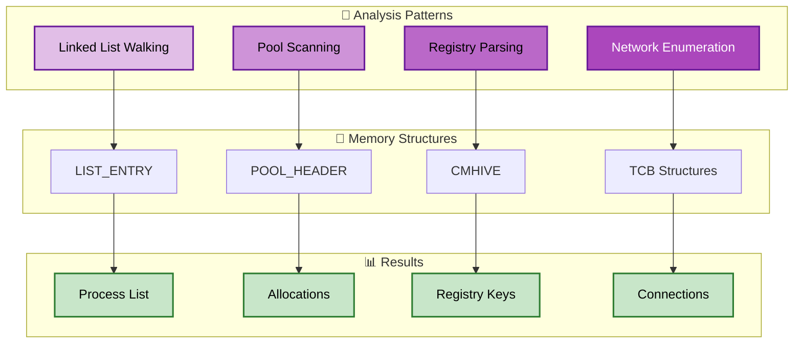

# Python Scripting Guide

## Table of Contents
- [Introduction](#introduction)
- [Setup](#setup)
- [Basic Scripting](#basic-scripting)
- [Memory Access](#memory-access)
- [Working with Structures](#working-with-structures)
- [Symbol Resolution](#symbol-resolution)
- [Advanced Techniques](#advanced-techniques)
- [Example Scripts](#example-scripts)
- [Best Practices](#best-practices)

## Introduction

inVtero.net supports IronPython scripting, allowing you to write Python scripts that interact with memory dumps through the .NET API. This provides a powerful way to automate analysis tasks and create custom memory forensics workflows.

### Why Python Scripting?

- **Rapid prototyping**: Test ideas quickly without recompiling
- **Interactive analysis**: Explore memory dumps in REPL
- **Custom workflows**: Automate repetitive analysis tasks
- **Dynamic typing**: Work with unknown structures easily
- **Extensive libraries**: Use Python's ecosystem

### IronPython vs CPython

inVtero.net uses **IronPython**, which runs on the .NET runtime:

**Advantages**:
- Direct access to .NET classes
- No marshaling overhead
- Full access to inVtero.net API

**Limitations**:
- IronPython 2.7 (not Python 3.x)
- No CPython C extensions (NumPy, etc.)
- Some standard library differences

## Setup

### Installing IronPython

**Windows**:
```cmd
# Download IronPython from:
# https://ironpython.net/

# Or install via Chocolatey
choco install ironpython

# Or use the bundled version with inVtero.net
```

**Verify installation**:
```cmd
ipy --version
# IronPython 2.7.x
```

### Setting up Script Environment

1. **Navigate to Scripts directory**:
   ```cmd
   cd inVtero.net\Scripts
   ```

2. **Ensure DLLs are accessible**:
   ```cmd
   # Copy DLLs to Scripts directory or set paths
   copy ..\inVtero.net\bin\Release\*.dll .
   ```

3. **Test basic import**:
   ```cmd
   ipy
   >>> import clr
   >>> clr.AddReferenceToFileAndPath("inVtero.net.dll")
   >>> from inVtero.net import *
   >>> # Success!
   ```

## Basic Scripting

### Minimal Script

```python
# minimal.py
import clr
import System

# Load inVtero.net assembly
clr.AddReferenceToFileAndPath("inVtero.net.dll")

# Import namespaces
from inVtero.net import *
from System.IO import FileInfo

# Configure analysis
opts = ConfigOptions()
opts.FileName = "C:\\dumps\\memory.dmp"
opts.VersionsToEnable = PTType.GENERIC

# Run analysis
vtero = Scan.Scanit(opts)

# Print results
print("Found %d processes" % len(vtero.Processes))
for proc in vtero.Processes:
    print("  CR3: %016X Type: %s" % (proc.CR3Value, proc.PageTableType))
```

**Run**:
```cmd
ipy minimal.py
```

### Interactive REPL

```cmd
ipy

>>> import clr
>>> clr.AddReferenceToFileAndPath("inVtero.net.dll")
>>> from inVtero.net import *

>>> opts = ConfigOptions()
>>> opts.FileName = "memory.dmp"
>>> vtero = Scan.Scanit(opts)

>>> # Now interactively explore
>>> vtero.Processes[0].CR3Value
123456789

>>> dir(vtero)  # List all members
['CheckpointSaveState', 'KernelProc', 'MemAccess', 'Processes', ...]
```

### Common Imports

```python
# Core CLR and System
import clr
import System
from System import *
from System.IO import *
from System.Text import *

# inVtero.net
clr.AddReferenceToFileAndPath("inVtero.net.dll")
clr.AddReferenceToFileAndPath("inVtero.net.ConsoleUtils.dll")

from inVtero.net import *
from inVtero.net.ConsoleUtils import *
from inVtero.net.Hashing import *
from inVtero.net.Support import *

# Utilities
from System.Diagnostics import Stopwatch
from System.Collections.Generic import List
```

## Memory Access

### Reading Memory

```python
# Get memory access object
mem = proc.MemAccess

# Read different types
uint64_val = mem.ReadUInt64(address)
uint32_val = mem.ReadUInt32(address)
uint16_val = mem.ReadUInt16(address)
byte_val = mem.ReadByte(address)

# Read byte array
data = mem.ReadPhysicalMemory(address, length)

# Convert to Python types
import struct
value = struct.unpack("<Q", data)[0]  # Little-endian uint64
```

### Reading Strings

```python
# ASCII string
ascii_str = mem.ReadString(address, max_length=256)

# Unicode (UTF-16) string
unicode_str = mem.ReadUnicodeString(address, max_length=256)

# Null-terminated string (manual)
def read_cstring(mem, address, max_len=1024):
    chars = []
    for i in range(max_len):
        byte = mem.ReadByte(address + i)
        if byte == 0:
            break
        chars.append(chr(byte))
    return ''.join(chars)
```

### Scanning Memory

```python
# Create byte array for pattern
pattern = System.Array[System.Byte]([0x4D, 0x5A])  # MZ header

# Scan physical memory
for addr in mem.ScanFor(pattern):
    print("Found at: %016X" % addr)
    
# Scan with context
def scan_with_context(mem, pattern, context_size=16):
    for addr in mem.ScanFor(pattern):
        # Read surrounding bytes
        before = mem.ReadPhysicalMemory(addr - context_size, context_size)
        after = mem.ReadPhysicalMemory(addr + len(pattern), context_size)
        yield addr, before, after
```

### Virtual Memory Access

```python
# Read from virtual address (requires page table)
virtual_addr = 0x7FF000000000
try:
    data = proc.MemAccess.ReadVirtualMemory(virtual_addr, 4096)
except:
    print("Virtual address not mapped")

# Check if address is valid first
if proc.PT.IsValidAddress(virtual_addr):
    data = proc.MemAccess.ReadVirtualMemory(virtual_addr, 4096)
```

## Working with Structures

### Loading Symbols

```python
# Get kernel process (lowest CR3 usually)
kernel_proc = min(vtero.Processes, key=lambda p: p.CR3Value)

# Set up memory access
kernel_proc.MemAccess = Mem(vtero.MemAccess)

# Scan for modules and load symbols
kvs = kernel_proc.ScanAndLoadModules()

print("Loaded %d modules" % len(kvs.Modules))
```

### Getting Type Information

```python
# Get type by name
eproc_type = kvs.GetTypeInfo("_EPROCESS")

print("Type: %s" % eproc_type.Name)
print("Size: %d bytes" % eproc_type.Size)

# List fields
for field in eproc_type.Fields:
    print("  %s @ offset %d" % (field.Name, field.Offset))
```

### Reading Structures

```python
# Read structure at address
eproc_addr = 0xFFFF8000DEADBEEF
eproc = proc.GetStructure(eproc_addr, eproc_type)

# Access fields dynamically
pid = eproc.UniqueProcessId
image_name = eproc.ImageFileName
create_time = eproc.CreateTime

print("PID: %d Name: %s" % (pid, image_name))
```

### Manual Structure Parsing

```python
class EPROCESS:
    """Manually defined structure"""
    
    def __init__(self, mem, address, kvs):
        self.address = address
        
        # Get offsets from symbols
        type_info = kvs.GetTypeInfo("_EPROCESS")
        
        pid_offset = type_info.GetFieldOffset("UniqueProcessId")
        name_offset = type_info.GetFieldOffset("ImageFileName")
        
        # Read fields
        self.pid = mem.ReadUInt64(address + pid_offset)
        self.image_name = mem.ReadString(address + name_offset, 16)
    
    def __str__(self):
        return "PID: %d Name: %s" % (self.pid, self.image_name)

# Usage
eproc = EPROCESS(mem, address, kvs)
print(eproc)
```

## Symbol Resolution

### Finding Kernel Symbols

```python
# Load kernel symbols
kvs = kernel_proc.ScanAndLoadModules()

# Get symbol addresses
ps_active_head = kvs.PsActiveProcessHead
ps_loaded_modules = kvs.PsLoadedModuleList

print("PsActiveProcessHead: %016X" % ps_active_head)

# Get arbitrary symbol
symbol_addr = kvs.GetSymbolAddress("MmUserProbeAddress")
print("MmUserProbeAddress: %016X" % symbol_addr)
```

### Module Information

```python
# List all loaded modules
for module in kvs.Modules:
    print("Module: %s" % module.Name)
    print("  Base: %016X" % module.BaseAddress)
    print("  Size: %d bytes" % module.Size)
    print("  PDB: %s" % module.PDBPath)
    
    # Verify module integrity
    if module.VerifyHash():
        print("  [OK] Hash verified")
    else:
        print("  [!] Hash mismatch - possible modification")
```

### Type Lookup

```python
def get_structure_size(kvs, type_name):
    """Get size of a structure type"""
    try:
        type_info = kvs.GetTypeInfo(type_name)
        return type_info.Size
    except:
        return None

# Usage
eproc_size = get_structure_size(kvs, "_EPROCESS")
print("EPROCESS size: %d" % eproc_size)
```

## Advanced Techniques

### Memory Analysis Patterns



### Walking Linked Lists

```python
def walk_list_entry(mem, head_addr, entry_offset, struct_type, max_entries=1000):
    """
    Walk a Windows LIST_ENTRY doubly-linked list
    
    Args:
        mem: Memory access object
        head_addr: Address of list head
        entry_offset: Offset of LIST_ENTRY within structure
        struct_type: Type information for structure
        max_entries: Maximum entries to prevent infinite loops
    """
    entries = []
    current = mem.ReadUInt64(head_addr)  # Flink
    
    for i in range(max_entries):
        if current == head_addr:
            break
            
        # Calculate structure address
        struct_addr = current - entry_offset
        
        # Read structure
        obj = proc.GetStructure(struct_addr, struct_type)
        entries.append(obj)
        
        # Next entry
        current = mem.ReadUInt64(current)  # Flink
    
    return entries
```

### Walking Process List

```python
def walk_process_list(vtero, kernel_proc):
    """Walk EPROCESS list"""
    
    # Load symbols
    kvs = kernel_proc.ScanAndLoadModules()
    
    # Get list head
    ps_head = kvs.PsActiveProcessHead
    
    # Get EPROCESS type
    eproc_type = kvs.GetTypeInfo("_EPROCESS")
    
    # Get ActiveProcessLinks offset
    apl_offset = eproc_type.GetFieldOffset("ActiveProcessLinks")
    
    # Walk list
    mem = kernel_proc.MemAccess
    current = mem.ReadUInt64(ps_head)
    processes = []
    
    while True:
        if current == ps_head:
            break
        
        # Calculate EPROCESS address
        eproc_addr = current - apl_offset
        
        # Read EPROCESS
        eproc = kernel_proc.GetStructure(eproc_addr, eproc_type)
        
        processes.append({
            'pid': eproc.UniqueProcessId,
            'name': eproc.ImageFileName,
            'cr3': eproc.Pcb.DirectoryTableBase,
            'address': eproc_addr
        })
        
        # Next entry
        current = mem.ReadUInt64(current)
    
    return processes
```

### Pool Scanning

```python
def find_pool_allocations(mem, pool_tag, pool_type='Nonp'):
    """
    Find pool allocations by tag
    
    Args:
        mem: Memory access object
        pool_tag: 4-character pool tag (e.g., 'Proc')
        pool_type: 'Nonp' for NonPagedPool, 'Page' for PagedPool
    """
    # Convert tag to bytes
    tag_bytes = System.Array[System.Byte](
        [ord(c) for c in pool_tag.ljust(4)]
    )
    
    matches = []
    
    # Scan for pool header pattern
    for addr in mem.ScanFor(tag_bytes):
        # Validate pool header
        try:
            # Read pool header (simplified)
            header_size = mem.ReadUInt16(addr - 6)
            pool_type_byte = mem.ReadByte(addr - 4)
            
            # Validate
            if header_size > 0 and header_size < 0x1000:
                matches.append({
                    'address': addr - 8,
                    'size': header_size,
                    'tag': pool_tag
                })
        except:
            pass
    
    return matches
```

### Registry Hive Parsing

```python
def find_registry_hives(mem):
    """Find CMHIVE structures in memory"""
    
    # Scan for registry signature 'regf'
    regf_sig = System.Array[System.Byte]([0x72, 0x65, 0x67, 0x66])
    
    hives = []
    for addr in mem.ScanFor(regf_sig):
        try:
            # Read hive header
            sequence1 = mem.ReadUInt32(addr + 4)
            sequence2 = mem.ReadUInt32(addr + 8)
            
            # Validate
            if sequence1 == sequence2:
                hives.append({
                    'base_block': addr,
                    'sequence': sequence1
                })
        except:
            pass
    
    return hives
```

### Network Connection Enumeration

```python
def enumerate_network_connections(kvs, mem):
    """
    Find network connections (Windows)
    Simplified example - actual implementation is more complex
    """
    # This is a simplified example
    # Real implementation would walk TCP/UDP tables
    
    connections = []
    
    # Find tcpip.sys module
    tcpip = None
    for module in kvs.Modules:
        if 'tcpip.sys' in module.Name.lower():
            tcpip = module
            break
    
    if tcpip is None:
        return []
    
    # Would need to:
    # 1. Find PartitionTable in tcpip.sys
    # 2. Walk hash table buckets
    # 3. Parse TCB structures
    # 4. Extract connection info
    
    return connections
```

## Example Scripts

### Complete Analysis Script

```python
#!/usr/bin/env ipy
"""
complete_analysis.py - Complete memory dump analysis
"""
import clr
import System
clr.AddReferenceToFileAndPath("inVtero.net.dll")

from inVtero.net import *
from System.IO import File, Directory
from System.Diagnostics import Stopwatch

def analyze_dump(dump_path):
    """Perform complete analysis of memory dump"""
    
    print("[*] Analyzing: %s" % dump_path)
    
    # Configure
    opts = ConfigOptions()
    opts.FileName = dump_path
    opts.VersionsToEnable = PTType.GENERIC
    opts.VerboseLevel = 1
    
    # Scan
    timer = Stopwatch.StartNew()
    vtero = Scan.Scanit(opts)
    timer.Stop()
    
    print("[+] Scan completed in %.2f seconds" % timer.Elapsed.TotalSeconds)
    print("[+] Found %d processes" % len(vtero.Processes))
    
    # Identify kernel process
    kernel = min(vtero.Processes, key=lambda p: p.CR3Value)
    print("[+] Kernel CR3: %016X" % kernel.CR3Value)
    
    # Load symbols
    print("[*] Loading symbols...")
    kernel.MemAccess = Mem(vtero.MemAccess)
    kvs = kernel.ScanAndLoadModules()
    print("[+] Loaded %d modules" % len(kvs.Modules))
    
    # Walk process list
    print("\n[*] Walking process list...")
    processes = walk_process_list(vtero, kernel)
    
    print("\nProcesses:")
    print("-" * 70)
    print("%-6s %-20s %-16s" % ("PID", "Name", "CR3"))
    print("-" * 70)
    
    for proc in sorted(processes, key=lambda p: p['pid']):
        print("%-6d %-20s %016X" % 
              (proc['pid'], proc['name'], proc['cr3']))
    
    # Check for suspicious modules
    print("\n[*] Checking module integrity...")
    modified_modules = []
    
    for module in kvs.Modules:
        if not module.VerifyHash():
            modified_modules.append(module.Name)
    
    if modified_modules:
        print("[!] Modified modules detected:")
        for name in modified_modules:
            print("    - %s" % name)
    else:
        print("[+] All modules verified")
    
    return vtero, kernel, kvs, processes

# Helper function from earlier
def walk_process_list(vtero, kernel_proc):
    # ... (implementation from earlier)
    pass

if __name__ == '__main__':
    import sys
    
    if len(sys.argv) < 2:
        print("Usage: ipy complete_analysis.py <dump_file>")
        sys.exit(1)
    
    dump_file = sys.argv[1]
    
    if not File.Exists(dump_file):
        print("Error: File not found: %s" % dump_file)
        sys.exit(1)
    
    analyze_dump(dump_file)
```

### Malware Detection Script

```python
"""
malware_detection.py - Simple malware indicators
"""
def detect_suspicious_processes(processes):
    """Detect suspicious process characteristics"""
    
    suspicious = []
    
    for proc in processes:
        flags = []
        
        # Check for hidden processes (in memory but not in EPROCESS list)
        # Check for unusual parent-child relationships
        # Check for suspicious names
        if proc['name'].lower() in ['svchost.exe', 'csrss.exe']:
            # Validate expected paths
            flags.append('Common target for impersonation')
        
        # Check for processes without parent
        # Check for processes with no threads
        # etc.
        
        if flags:
            suspicious.append({
                'process': proc,
                'flags': flags
            })
    
    return suspicious

def scan_for_code_injection(kvs, mem):
    """Scan for code injection indicators"""
    
    indicators = []
    
    # Look for:
    # - Unbacked executable pages
    # - RWX (Read-Write-Execute) pages
    # - Hooks in system DLLs
    # - Modified import tables
    
    return indicators
```

## Best Practices

### Error Handling

```python
def safe_read(mem, address, length):
    """Safely read memory with error handling"""
    try:
        return mem.ReadPhysicalMemory(address, length)
    except System.AccessViolationException:
        print("Warning: Access violation at %016X" % address)
        return None
    except System.ArgumentException as e:
        print("Warning: Invalid argument: %s" % str(e))
        return None
    except Exception as e:
        print("Error reading memory: %s" % str(e))
        return None
```

### Progress Reporting

```python
def scan_with_progress(mem, pattern):
    """Scan memory with progress indication"""
    total_size = mem.Length
    chunk_size = 1024 * 1024  # 1MB chunks
    
    matches = []
    processed = 0
    
    while processed < total_size:
        # Update progress
        progress = (processed * 100) / total_size
        print("\rScanning: %.1f%%" % progress, end='')
        
        # Scan chunk
        # ... scanning logic ...
        
        processed += chunk_size
    
    print("\rScanning: 100.0%")
    return matches
```

### Caching Results

```python
# Cache symbol lookups
_symbol_cache = {}

def get_symbol_cached(kvs, symbol_name):
    """Get symbol with caching"""
    if symbol_name not in _symbol_cache:
        _symbol_cache[symbol_name] = kvs.GetSymbolAddress(symbol_name)
    return _symbol_cache[symbol_name]
```

### Logging

```python
import logging

logging.basicConfig(
    level=logging.INFO,
    format='%(asctime)s - %(levelname)s - %(message)s'
)

logger = logging.getLogger(__name__)

def analyze_with_logging(dump_path):
    logger.info("Starting analysis of %s", dump_path)
    
    try:
        vtero = Scan.Scanit(opts)
        logger.info("Found %d processes", len(vtero.Processes))
    except Exception as e:
        logger.error("Analysis failed: %s", str(e))
        raise
```

## Additional Resources

- **Example Scripts**: See `Scripts/` directory for more examples
- **API Reference**: [API_REFERENCE.md](API_REFERENCE.md)
- **User Guide**: [USER_GUIDE.md](USER_GUIDE.md)
- **IronPython Documentation**: https://ironpython.net/documentation/

## Common Issues

**Import errors**:
```python
# Ensure DLL path is correct
import os
dll_path = os.path.join(os.getcwd(), "inVtero.net.dll")
clr.AddReferenceToFileAndPath(dll_path)
```

**Type conversion**:
```python
# .NET to Python
net_int = System.Int64(123)
py_int = int(net_int)

# Python to .NET
py_bytes = [0x4D, 0x5A]
net_bytes = System.Array[System.Byte](py_bytes)
```

**String encoding**:
```python
# .NET strings are UTF-16
net_string = "Hello"
py_string = str(net_string)
```
