# inVtero.net

[](https://ktwo.visualstudio.com)
[](https://www.gnu.org/licenses/agpl-3.0)

**Cross-platform memory forensics framework for Virtual Machine Introspection and physical memory analysis**

inVtero.net uses microarchitecture-independent techniques to find and extract processes, hypervisors (including nested), and OS instances from memory dumps—without requiring OS-specific profiles or configurations.

## ✨ Features

- 🔍 **Automatic Process Detection** - No profiles or configuration needed
- 🖥️ **Multi-OS Support** - Windows, Linux, BSD (all versions)
- 🔄 **Nested Hypervisor Analysis** - VMware, Xen, Hyper-V
- 🔐 **Code Integrity Verification** - Cryptographic hash-based attestation
- 🐍 **Python Scripting** - IronPython for custom analysis workflows
- 🚀 **High Performance** - Multi-core parallel processing
- 📝 **Symbol Resolution** - Automatic PDB download from Microsoft symbol server
- 🎯 **Format Agnostic** - Supports .vmem, .vmsn, .dmp, .raw, .dd, .xendump

## 📚 Documentation

- **[Installation Guide](INSTALLATION.md)** - Platform-specific setup instructions
- **[User Guide](USER_GUIDE.md)** - Quick start and common workflows
- **[Architecture](ARCHITECTURE.md)** - System design and technical details
- **[API Reference](API_REFERENCE.md)** - Complete API documentation
- **[Python Scripting](PYTHON_SCRIPTING.md)** - Scripting guide and examples
- **[Development Guide](DEVELOPMENT.md)** - Contributing and building from source
- **[Troubleshooting](TROUBLESHOOTING.md)** - Common issues and solutions

## 🚀 Quick Start

### Windows

1. **Download binary package**:
   ```
   https://github.com/K2/inVtero.net/blob/master/quickdumps/publish.zip
   ```

2. **Register msdia140.dll** (IMPORTANT):
   ```cmd
   regsvr32 msdia140.dll
   ```

3. **Analyze a memory dump**:
   ```cmd
   quickdumps.exe -f "C:\dumps\memory.dmp"
   ```

### Linux / macOS

1. **Install .NET Core**:
   ```bash
   # Ubuntu/Debian
   sudo apt-get install dotnet-sdk-8.0
   
   # macOS
   brew install --cask dotnet-sdk
   ```

2. **Clone and build**:
   ```bash
   git clone --recursive https://github.com/K2/inVtero.net.git
   cd inVtero.net/inVtero.core
   dotnet build inVtero.core.sln -c Release
   ```

3. **Analyze**:
   ```bash
   cd quickcore/bin/Release/net6.0
   dotnet quickcore.dll -f /path/to/memory.dump
   ```

See **[INSTALLATION.md](INSTALLATION.md)** for detailed instructions.

## 🔄 Analysis Workflow

```mermaid
graph TB
    A[📁 Memory Dump<br/>.vmem .dmp .raw] --> B{🔍 Format<br/>Detection}
    B -->|VMware| C[🖥️ VMware Handler]
    B -->|Xen| D[🌐 Xen Handler]
    B -->|Crash Dump| E[💥 PAGEDUMP64 Handler]
    B -->|Generic| F[📄 Raw Handler]
    
    C --> G[🧩 Memory Run<br/>Extraction]
    D --> G
    E --> G
    F --> G
    
    G --> H[🔎 Page Table<br/>Scanner]
    H --> I[🎯 Self-Pointer<br/>Detection]
    H --> J[🌀 VMCS<br/>Detection]
    
    I --> K[📊 Process<br/>Grouping]
    J --> K
    
    K --> L[🔐 Symbol<br/>Resolution]
    L --> M[✨ Analysis<br/>Results]
    
    style A fill:#e1f5ff,stroke:#01579b,stroke-width:3px,color:#000
    style M fill:#c8e6c9,stroke:#2e7d32,stroke-width:3px,color:#000
    style H fill:#fff9c4,stroke:#f57f17,stroke-width:2px,color:#000
    style K fill:#f3e5f5,stroke:#6a1b9a,stroke-width:2px,color:#000
    style L fill:#ffe0b2,stroke:#e65100,stroke-width:2px,color:#000
```



## 💡 Usage Examples

### Command Line

```cmd
# Basic analysis
quickdumps.exe -f memory.dmp

# Save analysis state for faster re-analysis
quickdumps.exe -f memory.dmp --save
```

### Python Scripting

```python
import clr
clr.AddReferenceToFileAndPath("inVtero.net.dll")
from inVtero.net import *

# Configure and scan
opts = ConfigOptions()
opts.FileName = "memory.dmp"
opts.VersionsToEnable = PTType.GENERIC

vtero = Scan.Scanit(opts)

# Access detected processes
for proc in vtero.Processes:
    print(f"CR3: {proc.CR3Value:016X} Type: {proc.PageTableType}")

# Load symbols and analyze
kernel = min(vtero.Processes, key=lambda p: p.CR3Value)
kvs = kernel.ScanAndLoadModules()
```

See **[USER_GUIDE.md](USER_GUIDE.md)** and **[PYTHON_SCRIPTING.md](PYTHON_SCRIPTING.md)** for more examples.

## 🎯 No Configuration Needed

inVtero.net uses **hardware-level detection techniques** instead of OS-specific profiles:

- **Self-Pointer Detection** (Windows) - Finds processes via PML4 self-referential entries
- **Recursive Page Directory** (BSD) - Identifies processes through recursive mappings  
- **VMCS Detection** - Locates hypervisors via Virtual Machine Control Structures
- **Direct Mapping** (Linux) - Detects kernel direct map regions

This approach works across **all OS versions** (Windows XP → Windows 11, Linux 2.6 → 6.x) without updates.

## 🏗️ Architecture Overview


## 📊 Supported Formats

| Format | Description | Source |
|--------|-------------|--------|
| `.vmem` | VMware snapshot memory | VMware Workstation/ESXi |
| `.vmsn` | VMware suspended state | VMware Workstation |
| `.dmp` | Windows crash dump | Windows BSOD (PAGEDUMP64) |
| `.raw`, `.dd` | Raw memory dump | Various acquisition tools |
| `.xendump` | Xen memory dump | Xen hypervisor |
| Generic | Flat binary file | Custom tools |

## 🔬 Technical Approach

### Process Detection

inVtero.net identifies processes using **microarchitecture-independent** techniques:

1. **Scan physical memory** for page table signatures
2. **Identify self-pointer patterns** in page tables
3. **Extract CR3 values** (page table base pointers)
4. **Validate page table hierarchies**
5. **Group processes** by memory correlation

### Hypervisor Detection

For nested VM analysis:

1. **Locate VMCS pages** by signature
2. **Extract EPTP** (Extended Page Table Pointer)
3. **Map guest physical to host physical** memory
4. **Recursively analyze** nested VMs

### Why This Works

Traditional tools require:
- ❌ OS version-specific profiles
- ❌ Manual configuration
- ❌ Frequent updates for new OS versions

inVtero.net leverages:
- ✅ Hardware-level invariants
- ✅ CPU-OS interaction patterns
- ✅ Self-describing page tables
- ✅ Future-proof detection

## 🖥️ GUI and Scripting

New UI for memory editing (dis/assemble and patch) supported formats.  Use "Loader()" on a vtero instance like;

```
Loader(test(MemList))
```


Change MemoryDump string to point to a memory dump.  Example memory dump walking and type system
explanation in analyze.py, see WalkProcListExample() 

```
quickdumps

>>> MemList = [ "c:\\temp\\win10.64.xendump" ]
>>> test(MemList)
 ++++++++++++++++++++++++++++++ ANALYZING INPUT [c:\temp\win10.64.xendump] ++++++++++++++++++++++++++++++
 PART RUNTIME: 00:00:08.5211677 (seconds), INPUT DUMP SIZE: 4,303,692,448.00 bytes.
SPEED: 466,980 KB / second  (all phases aggregate time)
 ++++++++++++++++++++++++++++++ DONE WITH INPUT [c:\temp\win10.64.xendump] ++++++++++++++++++++++++++++++
 >>> Loader(vtero)
```


### Supported:

* VMWARE 
* XEN 
* Crash dump (PAGEDUMP64 / Blue Screen dump files)
* Symbolic type extraction / binding 
  * DLR Scripting (Python)
* Basic Linux (Primary support on: BSD, HyperV, Windows, Generic (Self pointer page tables)) 


Find/Extract processes, hypervisors (including nested) in memory dumps using microarchitecture independent
Virtual Machine Introspection techniques.  Cross platform, multi-architechture high performance physical memory analysis tools.

| x64 Release |
|:------------|
||


## quickdumps
Quickdumps is an example of using the inVtero.net API to extract and validate physical memory.

### NEW STUFF
* New memory run detection
* Windows kernel memory address randomization (including page table base self/entry)


### Ideal circumstances
The way we initialize our virtual to physical address translation, there are no dependencies on input file format.  Any .DMP,
.RAW, .DD should be fine.  There is a big if unfortunately,  if the underlying capture format uses some form of extents storage
(i.e. does not consume physical storage for NULL, or NOT PRESENT pages) your mileage may vary.  There are lots of tools for
converting memory dumps, volatility - rekal are some good places to start.  BITMAP. DMP files are on the todo to make analysis
of livedump's easier (currently things work best if you do a manually initiated blue screen with a complete dump configured or
use a 3rd party raw dd type tool).

### Future proof
Several concepts are put to use to ensure we interact with the user only when required.  Similarly, to the
[Actaeon](http://www.syssec-project.eu/m/page-media/3/raid13_graziano.pdf) github project @eurecom-s3/actaeon, a primary
goal is to locate and leverage the VMCS page in order to locate the configured EPTP (extended page table pointer) which is
needed to locate the physical pages that belong to a guest OS instance.  Google @google/rekall rekal subsequently implemented 
a more expansive implementation which requires the user to run a Linux kernel module on the system that a given memory dump
originates that is meant to construct a specialized profile that can be used to then import into a local rekal profile which
will enable you to then isolate/extract guest memory from a physical host dump.

### Easy way
During CanSecWest/DC22 I presented a high quality technique (based on the lowest layer interaction between the CPU and 
OS mm layers) to identify any process running on a system by inspecting physical memory snapshots.  This mechanism is based on
what's called the self-pointer (Windows) or recursive page directory pointer (*BSD) that is always expected to be found 
(unless your Windows system has a heavily modified/patched mm, or simply a custom kernel for *BSD).  The net result of this
is that we know all given CR3 register values.  Since the VMCS contains at least 1 known CR3 value (a second one may be 
emulated or dynamically remapped) we have confidence that a comprehensive memory dump can be performed without knowing anything
about the underlying OS version (e.g. XP(64bit)->Win2016 are consistent) or microarchitecture.

### Speed 
Brute force always win's at the end of the day!  Or so I hear...  In any case, if an unknown VMCS mapping is found (EPTP index),
quickdumps will emit a set of possible values/indexes.  The list is usually small, 10-20 at the most.  An upcoming feature
is to automate attempts for each possible value until one that 'works' is found.  This should ensure we work for upcoming 
CPU microarchitectures without any code changes (or I will likely setup some class's that specify these to make life easy).
Either way, brute forcing should be fairly quick.  I try to make the most of multi-core CPU's, so if you have extra cores, 
they will likely get a workout if your analyzing a huge dump with many VM's.

Example run from a laptop:
```

Process CR3 [00000002DD41F000] File Offset [0000000293A12000] Diff [FFFFFFFFB65F3000] Type [Windows]
159 candiate process page tables. Time so far: 00:01:01.4826693, second pass starting. rate: 32588.149 MB/s
Hypervisor: VMCS revision field: 16384 [00004000] abort indicator: NO_ABORT [00000000]▒▒▒▒▒▒▒▒▒▒▒▒▒▒▒▒▒▒▒▒▒▒▒▒▒▒▒▒▒▒▒▒▒▒▒▒▒▒▒▒▒▒▒▒▒▒▒▒▒▒▒▒▒▒▒▒▒▒▒▒▒▒▒▒▒▒▒▒▒▒▒▒▒▒▒▒▒▒▒▒▒▒▒▒▒▒▒▒▒▒▒▒▒▒▒▒▒▒▒▒▒▒▒▒▒
Hypervisor: Windows CR3 found [00000000016A0000)] byte-swapped: [00006A0100000000] @ PAGE/File Offset = [00000001262DA000]
[435][00000000006F0054]
Hypervisor: VMCS revision field: VMWARE_NESTED [00000001] abort indicator: NO_ABORT [00000000]
Hypervisor: Windows CR3 found [00000000001AB000)] byte-swapped: [00B01A0000000000] @ PAGE/File Offset = [00000001308D3000]
[14][000000007433301E]
Hypervisor: VMCS revision field: VMWARE_NESTED [00000001] abort indicator: NO_ABORT [00000000]
Hypervisor: Windows CR3 found [00000000001AB000)] byte-swapped: [00B01A0000000000] @ PAGE/File Offset = [0000000130AD1000]
[14][000000007433301E]
Hypervisor: VMCS revision field: VMWARE_NESTED [00000001] abort indicator: NO_ABORT [00000000]
Hypervisor: Windows CR3 found [00000000001AB000)] byte-swapped: [00B01A0000000000] @ PAGE/File Offset = [00000001314CF000]
[14][000000007433301E]
Hypervisor: VMCS revision field: 0 [00000000] abort indicator: NO_ABORT [00000000]
Hypervisor: Windows CR3 found [00000000016A0000)] byte-swapped: [00006A0100000000] @ PAGE/File Offset = [0000000160643000]
[106][00000000001E001C]
Hypervisor: VMCS revision field: VMWARE_NESTED [00000001] abort indicator: NO_ABORT [00000000]
Hypervisor: Windows CR3 found [00000000001AB000)] byte-swapped: [00B01A0000000000] @ PAGE/File Offset = [0000000195922000]
[14][000000007433301E]
Hypervisor: VMCS revision field: VMWARE_NESTED [00000001] abort indicator: NO_ABORT [00000000]
Hypervisor: Windows CR3 found [00000000001AB000)] byte-swapped: [00B01A0000000000] @ PAGE/File Offset = [00000001959A3000]
[14][000000007433301E]
159 candiate VMCS pages. Time to process: 00:02:51.8973861
Data scanned: 34,171,150,654.00Second pass done.  rate: 1277.967 MB/s▒▒▒▒▒▒▒▒▒▒▒▒▒▒▒▒▒▒▒▒▒▒▒▒▒▒▒▒▒▒▒▒▒▒▒▒▒▒▒▒▒▒▒▒▒▒▒▒▒▒▒▒▒▒▒▒▒▒▒▒▒▒▒▒▒▒▒▒▒▒▒▒▒▒▒▒▒▒▒▒▒▒▒▒▒▒▒▒▒▒▒▒▒▒▒▒▒▒▒▒▒▒▒▒▒▒▒▒▒▒▒▒▒▒▒▒▒▒▒▒▒▒
grouping and joinging all memory
Scanning for group correlations
MemberProces: Groupt 1 Type [Windows] Group Correlation  [100.000 %] PID [1AB000]
MemberProces: Groupt 1 Type [Windows] Group Correlation  [90.909 %] PID [16A0000]
MemberProces: Groupt 1 Type [Windows] Group Correlation  [90.909 %] PID [1FCA000]
MemberProces: Groupt 1 Type [Windows] Group Correlation  [90.909 %] PID [62AB000]

```
## If you see above, 

```
MemberProces: Groupt 1 Type [Windows] Group Correlation [90.909 %] PID [34CE8000]
MemberProces: Groupt 1 Type [Windows] Group Correlation [90.909 %] PID [37300000]
MemberProces: Groupt 1 Type [Windows] Group Correlation [90.909 %] PID [7DCC6000]
Finished Group 1 collected size 48 next group
Scanning for group correlations
MemberProces: Groupt 2 Type [FreeBSD] Group Correlation [100.000 %] PID [65C8000]
MemberProces: Groupt 2 Type [FreeBSD] Group Correlation [100.000 %] PID [6B51000]
MemberProces: Groupt 2 Type [FreeBSD] Group Correlation [100.000 %] PID [6CC9000]


```

In the above example, VMWARE's EPTP is at index 14 in it's VMCS.

### Bugs :(
~~* We'll see if I get this one knocked out but right now it's only dumping kernel memory from each layer.  Working on user-space
        from guest OS VM's.~~ 
* Lots of TODO's but I'm going to add as soon as possible.  The main issue right now is that I'm really hesitant to add anything
   that's OS supplied even if it'd be a huge help.  I think sufficient context is available to avoid adding any logical OS dependencies.
   I like how Rekal pledges this but it seems their profile archive is very large also, so a bit of both.  
   There's a bit of cleanup to do still. This is still alpha, but will be actively developing.

* Expand to more known EPTP types so no brute force required
    * Brute force only takes a minute or so though... ;)
* Going to create a PFN bitmap index to auto-magically determine run's (currently, if your trying to dump/query anything after a run,
   it will cause problems or be missed etc.  Will be adding this next to ensure we get 100% comprehensive dumps.

## Goals
To refrain from using OS logical structures to support memory analysis.  It's likely that most OS layer structures, data,
code and objects may be manipulated by an attacker to misdirect an analyst’s efforts.

Upcoming functionality to render an integrity map for code pages that can be mapped back to cryptographically secure block/page hash values (i.e. SHA256 or TIGER192).  Our results indicate pre-win10 verification rates over 99%, post win10 volatile memory is virtually 100% attestable.  This eliminates substantional guess work and unkown's due to traditional manual handling/review/dissassembly of memory when attempting to detect/analyze multi-gigabytes of input.


[Documentation](http://ShaneK2.github.io/inVtero.net)  
[GUI Implementation](https://blockwatch.ioactive.com/)
