# Troubleshooting Guide

## Table of Contents
- [Installation Issues](#installation-issues)
- [Runtime Errors](#runtime-errors)
- [Symbol Resolution Problems](#symbol-resolution-problems)
- [Memory Dump Issues](#memory-dump-issues)
- [Performance Problems](#performance-problems)
- [Platform-Specific Issues](#platform-specific-issues)
- [Getting Help](#getting-help)

## 🔍 Troubleshooting Decision Tree

```mermaid
graph TD
    Start([🚨 Issue Encountered]) --> Type{Issue Type?}
    
    Type -->|Installation| Install[📦 Installation Issues]
    Type -->|Runtime| Runtime[⚠️ Runtime Errors]
    Type -->|Symbols| Symbols[🔐 Symbol Problems]
    Type -->|Dump| Dump[💾 Dump Issues]
    Type -->|Performance| Perf[🚀 Performance]
    
    Install --> WinDLL{msdia140.dll<br/>error?}
    WinDLL -->|Yes| RegDLL[✅ Register DLL:<br/>regsvr32 msdia140.dll]
    WinDLL -->|No| NetSDK{.NET SDK<br/>missing?}
    NetSDK -->|Yes| InstallNet[✅ Install .NET SDK]
    NetSDK -->|No| Submod{Submodules<br/>missing?}
    Submod -->|Yes| InitSub[✅ git submodule<br/>update --init]
    
    Runtime --> NoProc{No processes<br/>detected?}
    NoProc -->|Yes| TryGeneric[✅ Try PTType.GENERIC]
    NoProc -->|No| AccessViol{Access<br/>violation?}
    AccessViol -->|Yes| ValidateAddr[✅ Validate addresses<br/>before access]
    AccessViol -->|No| OutOfMem{Out of<br/>memory?}
    OutOfMem -->|Yes| ReduceMem[✅ Process in chunks<br/>Close other apps]
    
    Symbols --> NoDownload{Symbols not<br/>downloading?}
    NoDownload -->|Yes| CheckPath[✅ Check _NT_SYMBOL_PATH]
    NoDownload -->|No| WrongSym{Wrong symbols<br/>loaded?}
    WrongSym -->|Yes| ClearCache[✅ Clear symbol cache]
    
    Dump --> BadFormat{Format not<br/>detected?}
    BadFormat -->|Yes| Convert[✅ Convert with<br/>volatility/vmss2core]
    BadFormat -->|No| Incomplete{Incomplete<br/>dump?}
    Incomplete -->|Yes| Reacquire[✅ Re-acquire dump<br/>Use different tool]
    Incomplete -->|No| Gaps{Memory<br/>gaps?}
    Gaps -->|Yes| FlatRun[✅ ForceSingleFlatMemRun]
    
    Perf --> SlowScan{Slow<br/>scanning?}
    SlowScan -->|Yes| UseSSD[✅ Use SSD<br/>Disable verbose]
    SlowScan -->|No| HighMem{High memory<br/>usage?}
    HighMem -->|Yes| ProcessChunks[✅ Process selectively<br/>Dispose objects]
    HighMem -->|No| SlowSymbols{Slow symbol<br/>loading?}
    SlowSymbols -->|Yes| LocalCache[✅ Use local cache<br/>Pre-download symbols]
    
    RegDLL --> Success([✅ Resolved])
    InstallNet --> Success
    InitSub --> Success
    TryGeneric --> Success
    ValidateAddr --> Success
    ReduceMem --> Success
    CheckPath --> Success
    ClearCache --> Success
    Convert --> Success
    Reacquire --> Success
    FlatRun --> Success
    UseSSD --> Success
    ProcessChunks --> Success
    LocalCache --> Success
    
    style Start fill:#ef5350,stroke:#c62828,stroke-width:3px,color:#fff
    style Success fill:#66bb6a,stroke:#2e7d32,stroke-width:3px,color:#fff
    style Install fill:#ffb74d,stroke:#f57c00,stroke-width:2px,color:#000
    style Runtime fill:#ffb74d,stroke:#f57c00,stroke-width:2px,color:#000
    style Symbols fill:#ffb74d,stroke:#f57c00,stroke-width:2px,color:#000
    style Dump fill:#ffb74d,stroke:#f57c00,stroke-width:2px,color:#000
    style Perf fill:#ffb74d,stroke:#f57c00,stroke-width:2px,color:#000
```



## Installation Issues

### Windows: msdia140.dll Not Registered

**Symptoms**:
```
Unable to load DLL 'msdia140.dll': The specified module could not be found.
```

**Solutions**:

1. **Register the DLL**:
   ```cmd
   # Run as Administrator
   cd C:\Path\To\inVtero
   regsvr32 msdia140.dll
   ```

2. **Find the DLL in Visual Studio**:
   ```cmd
   # Visual Studio 2022
   regsvr32 "C:\Program Files\Microsoft Visual Studio\2022\Community\DIA SDK\bin\amd64\msdia140.dll"
   
   # Visual Studio 2019
   regsvr32 "C:\Program Files (x86)\Microsoft Visual Studio\2019\Community\DIA SDK\bin\amd64\msdia140.dll"
   ```

3. **Copy to System Directory**:
   ```cmd
   copy msdia140.dll C:\Windows\System32\
   regsvr32 C:\Windows\System32\msdia140.dll
   ```

4. **Install Visual C++ Redistributables**:
   - Download from: https://aka.ms/vs/17/release/vc_redist.x64.exe
   - Install and reboot

**Verification**:
```cmd
# Should succeed without errors
regsvr32 /s msdia140.dll
echo %ERRORLEVEL%
# Should output: 0
```

### Linux: .NET SDK Not Found

**Symptoms**:
```
bash: dotnet: command not found
```

**Solutions**:

**Ubuntu/Debian**:
```bash
# Add Microsoft package repository
wget https://packages.microsoft.com/config/ubuntu/22.04/packages-microsoft-prod.deb
sudo dpkg -i packages-microsoft-prod.deb
rm packages-microsoft-prod.deb

# Install .NET SDK
sudo apt-get update
sudo apt-get install -y dotnet-sdk-8.0

# Verify
dotnet --version
```

**Fedora**:
```bash
sudo dnf install dotnet-sdk-8.0
```

**Manual Installation**:
```bash
# Download from https://dotnet.microsoft.com/download
wget https://dot.net/v1/dotnet-install.sh
chmod +x dotnet-install.sh
./dotnet-install.sh --channel 8.0

# Add to PATH
export PATH=$PATH:$HOME/.dotnet
echo 'export PATH=$PATH:$HOME/.dotnet' >> ~/.bashrc
```

### Git Submodules Not Initialized

**Symptoms**:
```
Build error: Cannot find referenced project 'Dia2Sharp'
Missing directories in repository
```

**Solution**:
```bash
# Initialize all submodules
git submodule update --init --recursive

# Verify
git submodule status
# Should show commit hashes, not minuses
```

### NuGet Package Restore Failures

**Symptoms**:
```
Error: Package 'xxx' not found
Could not restore NuGet packages
```

**Solutions**:

1. **Clear NuGet cache**:
   ```bash
   # Windows
   nuget locals all -clear
   
   # Linux/macOS
   dotnet nuget locals all --clear
   ```

2. **Restore manually**:
   ```bash
   dotnet restore inVtero.net.sln
   # or
   nuget restore inVtero.net.sln
   ```

3. **Check NuGet sources**:
   ```bash
   nuget sources list
   
   # Add nuget.org if missing
   nuget sources add -Name "nuget.org" -Source "https://api.nuget.org/v3/index.json"
   ```

## Runtime Errors

### No Processes Detected

**Symptoms**:
```
Found 0 processes
Scan completed but no results
```

**Diagnosis**:
```python
# Enable verbose output
Vtero.VerboseOutput = True
Vtero.DiagOutput = True
Vtero.VerboseLevel = 2
```

**Common Causes & Solutions**:

1. **Wrong OS Type**:
   ```python
   # Try GENERIC to detect all types
   copts.VersionsToEnable = PTType.GENERIC
   ```

2. **Corrupted Dump**:
   ```bash
   # Check file integrity
   file memory.dmp
   md5sum memory.dmp
   
   # Try converting format
   # Using volatility:
   vol.py -f input.dmp raw2dmp -o output.raw
   ```

3. **Sparse Memory Dump**:
   ```python
   # Force single flat run
   copts.ForceSingleFlatMemRun = True
   ```

4. **Incomplete Dump**:
   - Verify dump size matches RAM size
   - Re-acquire dump with different tool
   - Try partial analysis if possible

### Access Violation / Memory Errors

**Symptoms**:
```
System.AccessViolationException: Attempted to read or write protected memory
```

**Solutions**:

1. **Validate Address Before Access**:
   ```python
   if proc.PT and proc.PT.IsValidAddress(virtual_addr):
       data = mem.ReadVirtualMemory(virtual_addr, length)
   else:
       print("Invalid address: %016X" % virtual_addr)
   ```

2. **Check Memory Run Boundaries**:
   ```python
   # Ensure address is within valid runs
   for run in mem.Runs:
       if run.StartAddress <= phys_addr <= run.EndAddress:
           # Address is valid
           break
   ```

3. **Handle Exceptions**:
   ```python
   try:
       data = mem.ReadPhysicalMemory(addr, length)
   except System.AccessViolationException:
       print("Cannot access address: %016X" % addr)
       data = None
   ```

### Out of Memory

**Symptoms**:
```
System.OutOfMemoryException
Insufficient memory to continue execution
```

**Solutions**:

1. **Increase Available RAM**:
   - Close other applications
   - Use 64-bit version
   - Add more physical RAM

2. **Process in Chunks**:
   ```python
   # Don't load entire dump at once
   chunk_size = 1024 * 1024 * 100  # 100MB chunks
   for offset in range(0, mem.Length, chunk_size):
       process_chunk(offset, chunk_size)
   ```

3. **Enable Caching**:
   ```python
   copts.IgnoreSaveData = False  # Use saved state
   ```

4. **Disable Progress Bar**:
   ```python
   Vtero.DisableProgressBar = True  # Reduce memory overhead
   ```

## Symbol Resolution Problems

### Symbols Not Downloading

**Symptoms**:
```
Failed to download symbols for ntoskrnl.exe
PDB not found
```

**Solutions**:

1. **Check Symbol Path**:
   ```cmd
   # Windows
   echo %_NT_SYMBOL_PATH%
   
   # Linux/macOS
   echo $_NT_SYMBOL_PATH
   ```

2. **Set Symbol Path**:
   ```cmd
   # Windows
   setx _NT_SYMBOL_PATH "SRV*C:\Symbols*http://msdl.microsoft.com/download/symbols"
   
   # Linux/macOS
   export _NT_SYMBOL_PATH="SRV*$HOME/.symbols*http://msdl.microsoft.com/download/symbols"
   ```

3. **Check Internet Connection**:
   ```bash
   # Test connectivity to symbol server
   curl -I http://msdl.microsoft.com/download/symbols
   ```

4. **Check Firewall/Proxy**:
   ```cmd
   # Bypass proxy
   set HTTP_PROXY=
   set HTTPS_PROXY=
   ```

5. **Use Alternative Symbol Server**:
   ```cmd
   # Multiple servers
   setx _NT_SYMBOL_PATH "SRV*C:\Symbols*http://msdl.microsoft.com/download/symbols;SRV*http://chromium-browser-symsrv.commondatastorage.googleapis.com"
   ```

### Wrong Symbols Loaded

**Symptoms**:
```
Structure offsets incorrect
Type information doesn't match
Unexpected values in structures
```

**Solutions**:

1. **Clear Symbol Cache**:
   ```cmd
   # Windows
   del /S /Q C:\Symbols\*
   
   # Linux/macOS
   rm -rf ~/.symbols/*
   ```

2. **Verify PDB GUID**:
   ```python
   for module in kvs.Modules:
       print("Module: %s" % module.Name)
       print("  GUID: %s" % module.PDBGuid)
       print("  Age: %d" % module.Age)
   ```

3. **Manual PDB Download**:
   - Go to https://msdl.microsoft.com/download/symbols
   - Download specific PDB by GUID
   - Place in symbol directory

### Symbol Path Not Found

**Symptoms**:
```
Symbol path is null or empty
Using default symbol path
```

**Solution**:
```python
# Set in script
import System
System.Environment.SetEnvironmentVariable(
    "_NT_SYMBOL_PATH",
    "SRV*C:\\Symbols*http://msdl.microsoft.com/download/symbols"
)
```

## Memory Dump Issues

### Unsupported Format

**Symptoms**:
```
Unable to detect memory dump format
Unknown dump format
```

**Solutions**:

1. **Check File Type**:
   ```bash
   file memory.dump
   hexdump -C memory.dump | head -20
   ```

2. **Convert Format**:
   ```bash
   # Using volatility
   vol.py -f input.dmp imageinfo
   vol.py -f input.dmp --profile=Win10x64 raw2dmp -o output.raw
   
   # Using vmss2core (for VMware)
   vmss2core -W memory.vmsn memory.vmem
   ```

3. **Force Format Detection**:
   ```python
   # Try different run detectors
   from inVtero.net.Specialties import *
   
   # Try as crash dump
   detector = CrashDump()
   if detector.IsSupportedFormat(mem):
       descriptor = detector.ExtractMemory(mem)
   ```

### Incomplete Memory Dump

**Symptoms**:
```
High failed page count
Many missing pages
Low correlation scores
```

**Solutions**:

1. **Check Dump Type** (Windows):
   - Complete Memory Dump (best)
   - Kernel Memory Dump (good for kernel analysis)
   - Small Memory Dump (insufficient)

2. **Re-acquire Dump**:
   - Use different acquisition tool
   - Ensure sufficient disk space
   - Verify RAM size matches dump size

3. **Work with Partial Data**:
   ```python
   # Continue despite failures
   # Extract what's available
   available_pages = [p for p in proc.PT.Entries if p.Valid]
   ```

### Memory Gaps / Sparse Dumps

**Symptoms**:
```
Failed to read memory at offset X
Memory run not found
```

**Solutions**:

1. **Identify Gaps**:
   ```python
   for i, run in enumerate(mem.Runs):
       print("Run %d: %016X - %016X (%d pages)" % 
             (i, run.StartAddress, run.EndAddress, run.PageCount))
   ```

2. **Handle Gaps in Code**:
   ```python
   def safe_read_with_gaps(mem, addr, length):
       try:
           return mem.ReadPhysicalMemory(addr, length)
       except:
           # Try to read available portions
           return None
   ```

## Performance Problems

### Slow Scanning

**Symptoms**:
- Scanning takes > 5 minutes for 4GB dump
- CPU usage < 50%
- Disk I/O very high

**Solutions**:

1. **Use SSD**:
   - Move dump to SSD
   - Use RAM disk for temporary files

2. **Increase Parallelism**:
   ```python
   # Ensure parallel processing is enabled
   # Check CPU usage - should be near 100%
   ```

3. **Disable Verbose Output**:
   ```python
   Vtero.VerboseOutput = False
   Vtero.DisableProgressBar = True
   ```

4. **Use Saved State**:
   ```python
   copts.IgnoreSaveData = False
   # First run: slow, creates cache
   # Subsequent runs: fast, loads cache
   ```

### High Memory Usage

**Symptoms**:
- Process using > 16GB RAM
- System becomes unresponsive
- Swapping to disk

**Solutions**:

1. **Close Other Applications**

2. **Process Selectively**:
   ```python
   # Don't load all processes at once
   for proc in vtero.Processes[:5]:  # First 5 only
       analyze(proc)
   ```

3. **Dispose Objects**:
   ```python
   # Explicitly dispose when done
   proc.Dispose()
   mem.Dispose()
   ```

4. **Use Streaming**:
   ```python
   # Use streams instead of loading entire files
   using (var stream = new PhysicalMemoryStream(mem)):
       # Process stream
   ```

### Slow Symbol Loading

**Symptoms**:
- Symbol loading takes > 5 minutes
- High network usage
- Timeouts

**Solutions**:

1. **Use Local Symbol Cache**:
   ```cmd
   # Pre-download symbols
   symchk /r C:\Windows\System32\*.dll /s SRV*C:\Symbols*http://msdl.microsoft.com/download/symbols
   ```

2. **Disable Symbol Loading**:
   ```python
   # Skip symbols if not needed
   # Don't call ScanAndLoadModules()
   ```

3. **Use Alternative Symbol Server**:
   - Try different mirror
   - Use local symbol server

## Platform-Specific Issues

### Windows: Visual Studio Build Errors

**Symptoms**:
```
MSBuild error: Project file is corrupted
Unable to resolve dependencies
```

**Solutions**:

1. **Clean Solution**:
   ```
   Build → Clean Solution
   Close Visual Studio
   Delete bin/ and obj/ directories
   Reopen and rebuild
   ```

2. **Update NuGet Packages**:
   ```
   Tools → NuGet Package Manager → Package Manager Console
   Update-Package -reinstall
   ```

3. **Repair Visual Studio**:
   ```
   Control Panel → Programs → Visual Studio → Modify → Repair
   ```

### Linux: Missing Dependencies

**Symptoms**:
```
error: libicu is required
Cannot find libssl
```

**Solutions**:

**Ubuntu/Debian**:
```bash
sudo apt-get install -y \
    libicu-dev \
    libssl-dev \
    build-essential
```

**Fedora/RHEL**:
```bash
sudo dnf install -y \
    icu \
    openssl-devel \
    gcc \
    gcc-c++
```

### macOS: Code Signing Issues

**Symptoms**:
```
Code signature invalid
Application cannot be opened
```

**Solutions**:

1. **Remove Quarantine**:
   ```bash
   xattr -d com.apple.quarantine /path/to/inVtero
   ```

2. **Allow in Security Settings**:
   ```
   System Preferences → Security & Privacy → General
   Click "Allow Anyway"
   ```

## Getting Help

### Collecting Diagnostic Information

When reporting issues, include:

1. **Version Information**:
   ```bash
   # .NET version
   dotnet --version
   
   # inVtero.net version
   # Check AssemblyInfo.cs or dll properties
   ```

2. **System Information**:
   ```bash
   # Windows
   systeminfo
   
   # Linux
   uname -a
   cat /etc/os-release
   ```

3. **Dump Information**:
   ```bash
   # File size
   ls -lh memory.dmp
   
   # File type
   file memory.dmp
   
   # First few bytes
   hexdump -C memory.dmp | head -20
   ```

4. **Error Messages**:
   - Full error text
   - Stack trace
   - Verbose output

5. **Configuration**:
   ```python
   # ConfigOptions used
   print("FileName: %s" % copts.FileName)
   print("VersionsToEnable: %s" % copts.VersionsToEnable)
   print("VerboseLevel: %d" % copts.VerboseLevel)
   ```

### Enable Detailed Logging

```python
# Maximum verbosity
Vtero.VerboseOutput = True
Vtero.DiagOutput = True
Vtero.VerboseLevel = 3

# Capture output to file
import sys
sys.stdout = open('debug_output.txt', 'w')

# Run analysis
vtero = Scan.Scanit(copts)

# Close file
sys.stdout.close()
```

### Where to Get Help

1. **Documentation**:
   - [README.md](README.md)
   - [USER_GUIDE.md](USER_GUIDE.md)
   - [API_REFERENCE.md](API_REFERENCE.md)
   - [INSTALLATION.md](INSTALLATION.md)

2. **GitHub Issues**:
   - Search existing issues: https://github.com/K2/inVtero.net/issues
   - Create new issue with template

3. **Stack Overflow**:
   - Tag: `invtero` or `memory-forensics`

4. **Email**:
   - Check repository for contact information

### Issue Template

```markdown
**Description**
Brief description of the issue.

**Environment**
- OS: Windows 10 / Ubuntu 22.04 / macOS 13
- .NET Version: 8.0
- inVtero.net Version: [commit hash or version]

**Memory Dump**
- Format: .dmp / .vmem / .raw
- Size: 4GB
- Source OS: Windows 10 x64 Build 19041

**Steps to Reproduce**
1. Step 1
2. Step 2
3. Step 3

**Expected Behavior**
What should happen.

**Actual Behavior**
What actually happens.

**Error Messages**
```
Paste error messages here
```

**Verbose Output**
```
Paste verbose output here (first 50 lines)
```

**Additional Context**
Any other relevant information.
```

## Common Error Messages

### "Page table validation failed"
- Corrupted page tables
- Incorrect CR3 value
- Try different process or GENERIC mode

### "Failed to map physical address"
- Address outside memory runs
- Sparse dump with gaps
- Use ForceSingleFlatMemRun option

### "Symbol server timeout"
- Network connectivity issue
- Symbol server down
- Use local symbols or alternative server

### "Type not found in PDB"
- Wrong PDB version
- Incomplete symbols
- Clear cache and re-download

### "Insufficient permissions"
- Run as Administrator (Windows)
- Check file permissions
- Verify disk access

## Still Having Issues?

If this guide doesn't solve your problem:

1. Enable maximum verbosity
2. Collect diagnostic information
3. Search GitHub issues
4. Create detailed bug report
5. Be patient - maintainers are volunteers

**Remember**: Include as much detail as possible when asking for help!
